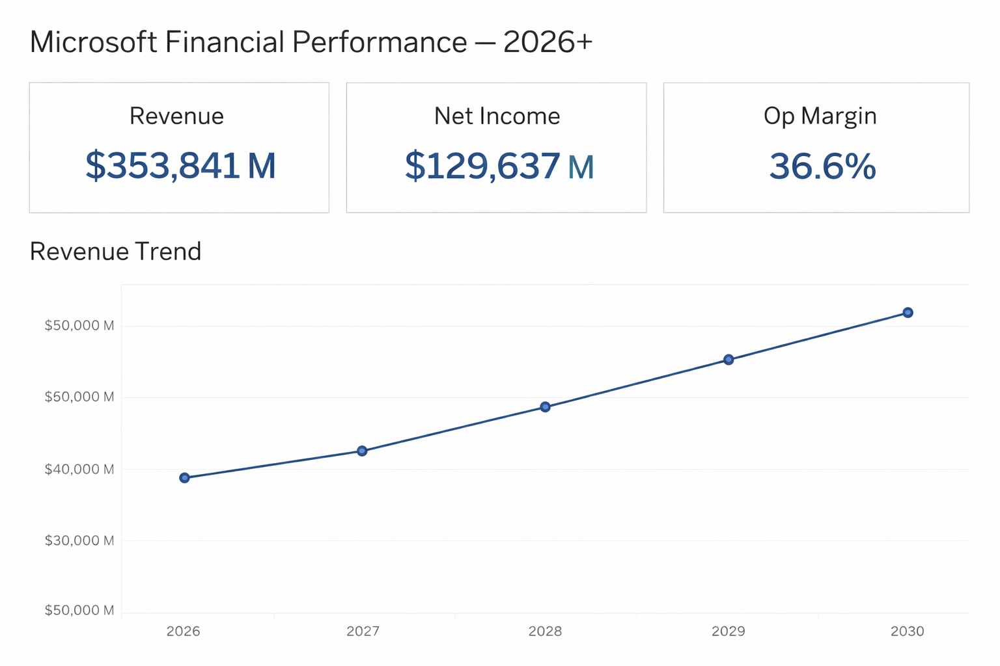

# Microsoft FP&A Dashboard — Data Visualization & Analytics Engineering Project

This project demonstrates my ability to design clear, executive-level data visualizations that translate complex financial data into actionable insights — a core skill for data visualization and analytics engineering roles at Netflix.

The dashboard is inspired by real-world FP&A and corporate finance reporting workflows and focuses on clarity, storytelling, and decision-making efficiency.

---

## Dashboard Overview

This dashboard presents a concise financial snapshot using KPI-driven design and trend analysis, optimized for leadership review.

---

## Key Business Questions Answered

- How is revenue trending over time?
- What is the current profitability (net income and operating margin)?
- How do forecasted revenues compare to current performance?
- Which metrics matter most at an executive glance?

---

## Metrics & Visual Components

- **Revenue (Actual)**  
  High-level topline performance indicator.

- **Net Income**  
  Profitability signal used for operational and strategic decisions.

- **Forecast Revenue**  
  Forward-looking view supporting planning and scenario analysis.

- **Operating Margin**  
  Efficiency metric highlighting cost discipline and scalability.

- **Revenue Trend Line**  
  Time-series visualization for pattern recognition and growth evaluation.

---

## Data Visualization Principles Applied

- **KPI-first layout** for immediate insight
- **Minimalist design** to reduce cognitive load
- **Consistent formatting** for financial comparability
- **Clear hierarchy** between summary metrics and trends
- **Story-driven structure** rather than raw charts

These principles align closely with Netflix’s emphasis on clear, honest, and impactful data communication.

---

## Tools & Technologies

- **Tableau** — dashboard design and KPI visualization  
- **Excel** — structured financial data modeling  
- **Financial modeling concepts** — FP&A-style metrics and forecasting  
- **Data storytelling** — translating numbers into insights  

- Build visualizations that support **real business decisions**
- Design dashboards for **non-technical stakeholders**
- Balance **analytical depth** with **visual simplicity**
- Communicate insights clearly without unnecessary complexity

---

## Author
 Affan Ibrahim  
Data Visualization & Analytics Engineering Candidate  

